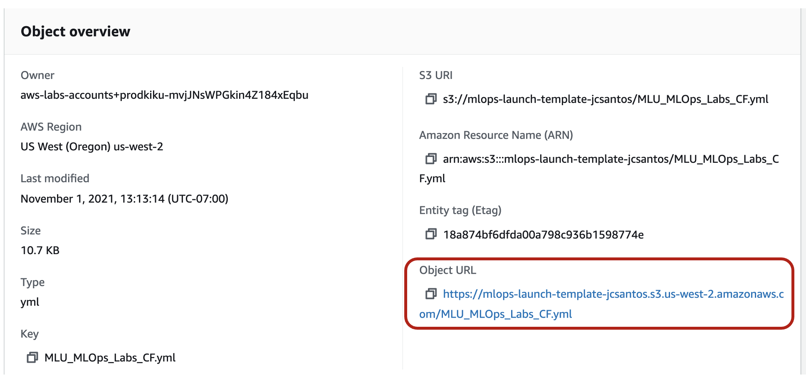
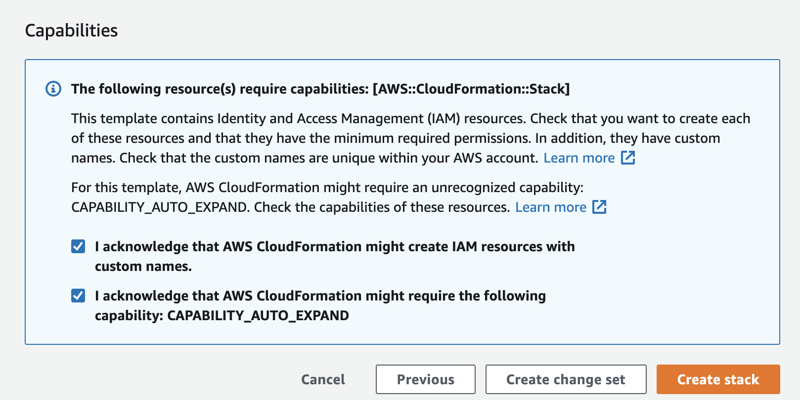

---

# MLU-MLOps Lab

In this lab, we will create and experiment an end-to-end ML Pipeline. 
This ML pipeline is supported by an automated infrastructure for training, testing, deploying and integrating ML Models. 
Furthermore, the model can be deployed in two different environments: DEV environment for QA/Development endpoint and PRD environment for Production endpoint. 
In addition, we will apply some stress tests to check the ML system scalability and stability. 
The lab content is also lectured by the ML Operation (MLOps) course in [Amazon Machine Learning University (MLU)](https://aws.amazon.com/machine-learning/mlu/).

---

#### Table of Contents  
- [Pre-requisites](#Pre-requisites)  
- [The Pipeline Architecture](#Architecture)
- [Lab Instructions](#Lab-Instructions)
  - [Lab 0 - Create an End-to-end pipeline with CloudFormation](#Lab-0)
  - [Lab 1 - Build/Train/Test via SageMaker](#Lab-1)
  - [Lab 2 - Automate an End-to-end ML Pipeline](#Lab-2)
- [Cleaning Up](#Cleaning-Up)
- [Supplementary](#Supplementary)
  - [MLU MLOps Introduction](#Introduction)
  - [Customized Docker Container](#customized)

---

<a name="Pre-requisites"/>

## Pre-requisites

### AWS Account

 You'll need an AWS Account with access to the services above. There are resources required by this workshop that are eligible for the [AWS Free Tier](https://aws.amazon.com/free/) if your account is less than 12 months old.

**WARNING**: if your account is more than 12 months old, you may get a bill.
(I launched this pipeline recently and stopped/deleted the system within an hour after it successfully launched, while I got a bill less than $1.
If you didn't delete the CloudFormation stack or any active sagemaker instances/hosting endpoints, you may get billed.)

### Knowledge Check

You should have some basic experience with:
  - Train/test a ML model
  - Python ([scikit-learn](https://scikit-learn.org/stable/#))
  - [Jupyter Notebook](https://jupyter.org/)
  - [AWS CodePipeline](https://aws.amazon.com/codepipeline/)
  - [AWS CodeCommit](https://aws.amazon.com/codecommit/)
  - [AWS CodeBuild](https://aws.amazon.com/codebuild/)
  - [Amazon ECR](https://aws.amazon.com/ecr/)
  - [Amazon SageMaker](https://aws.amazon.com/sagemaker/)
  - [AWS CloudFormation](https://aws.amazon.com/cloudformation/)

Some experience working with the AWS console is helpful as well.

---

<a name="Architecture"/>

## The ML Pipeline Architecture

The following image gives us a high level view of the architecture.

  

1. An ETL process or the ML Developer, prepares a new dataset for training the model and copies it into an S3 Bucket;
2. CodePipeline listens to this S3 Bucket, calls a Lambda function for starting training for a job in Sagemaker;
3. The lambda function sends a training job request to Sagemaker;
4. When the training is finished, CodePipeline gets its status and goes to the next stage if there is no error;
5. CodePipeline calls CloudFormation to deploy a model in a Development/QA environment into Sagemaker;
6. After finishing the deployment in DEV/QA, CodePipeline awaits for a manual approval
7. An approver approves or rejects the deployment. If rejected the pipeline stops here; If approved it goes to the next stage;
8. CodePipeline calls CloudFormation to deploy a model into production. This time, the endpoint will count with an AutoScaling policy for HA and Elasticity.
9. Done.

<a name="Lab-Instructions"/>

## Lab Instructions

The lab is composed of 3 parts:

1. In Lab 0, we will create an automated infrastructure via CloudFormation for training, testing, deploying and integrating ML Models. 
1. In Lab 1, we will train the model (using the built-in XGBoost or the a custom container if you ran the step 2), deploy them into a **DEV** environment, approve and deploy them into a **PRD** environment with high availability and elasticity;
1. In Lab 3, we will run some stress tests on the production endpoint to test the elasticity and simulate a situation where the number of requests on the ML model can vary.

<a name="Lab-0"/>

### Lab 0 - Create an End-to-end pipeline with CloudFormation

As we wish to build a repeatable, testable and auditable end-to-end pipeline, we will use CloudFormation, *an infrastructure automation platform for AWS*, to create all the components required for the exercises. 

#### Step 0. Upload files to S3

CloudFormation requires some templates (e.g. `.yaml` files) to launch a repeatable ML pipeline. Hence, we will need to upload the templates to a S3 bucket as shown below:

First, login to the AWS account and navigate to [S3 Buckets main page](https://s3.console.aws.amazon.com/s3/home?region=us-west-2#), and create an S3 bucket (Create Bucket) as below:

<a name="YOURALIAS"/>

  * the bucket name is “mlops-launch-template-YOURALIAS” (Please replace YOURALIAS with your own alias, e.g., `mlops-launch-template-rlhu` as shown in the below image);
  * the S3 bucket region will be *us-west-2*;
  * you don’t need to change other settings but go ahead to “Create bucket”.

Then, we will need to upload the CloudFormation `.yaml` files into this bucket. We have a set of sample scripts for you - [`MLOps Labs.zip`](https://github.com/goldmermaid/MLU-MLOps-Lab/raw/main/MLOps%20Labs.zip). This `.zip` file includes all the CloudFormation `.yml` files and sub `.zip` files to automate the overall pipelines. Let's *download* and *unzip* the `MLOps Labs.zip`; Next, we *upload* the above `.yml` and `.zip` files to the S3 bucket you just created. After uploading the files, the S3 bucket looks like:

  

#### Step 1. Create the CloudFormation Stack

Now we have the "ingredients" for CloudFormation to use, we can then create our stack to orchestrate the ML Pipeline. 

First, Go to [CloudFormation](https://us-west-2.console.aws.amazon.com/cloudformation/home?region=us-west-2#) at Region *us-west-2*. Once you are on the main page, click `Create stack` and the options as below:

  

Next, choose `Templates is ready` and `Amazon S3 URL`. To find the template's S3 URL, go to the S3 bucket you have created above and find the file named `MLU_MLOps_Labs_CF.yml`. 

  

Then, copy the *Object URL* as shown above, and paste the *Object URL* to the field *Amazon S3 URL* below and click *Next*.

  

Once the template is attached, we need to *Specify stack details*. In this lab, you can take any stack name and fill in the Stack name (e.g., `TESTXXX` as shown below). In addition, we need to specify the *NotebookInstanceSecGroupID* as “*default*”, and also choose any *SubNetid* except `172.31.*48*.0/20`. Last, replace the *UserAlias* with your own alias. The alias must be identical with `YOURALIAS`, i.e. the one you used to [create S3 bucket above](#YOURALIAS) (e.g. `rlhu` as shown below).

  

Next step is to `Configure stack options`. We will leave everything unchanged (as default) and click *Next*, i.e.,

  

The last step is to `Review XXXX` (Your stack name). You only need to scroll down to the bottom of this page, and check the following two IAM checks as below:

  

You can leave everything else unchanged and click `Create stack`. It will take about *10 minutes* to create the full stacks. After completion, it will show a “CREATE_COMPLETE” under [CloudFormation](https://console.aws.amazon.com/cloudformation/home?region=us-west-2#/) - `Stacks`.

<a name="Lab-1"/>

## Lab 1 - Lab 1 - Build/Train/Test via SageMaker

After the stacks were created, navigate to [Sagemaker notebook instances](https://us-west-2.console.aws.amazon.com/sagemaker/home?region=us-west-2#/notebook-instances). Here the Sagemaker notebook “MLOps_Lab” should be “*InService*”. Click Open Jupyter and navigate to the folder `MLU-MLOps-lab/lab`, you will see the following notebook:

  

Now, let’s warm up with the fundamental features of Sagemaker (e.g. training, deploying and optimizing a model) by playing with each cell of Jupyter Notebook lab1_TrainDeployTest.ipynb. (If you are already experienced with Sagemaker, you can skip this exercise.)

<a name="Lab-2"/>

## Lab 2 - Automate an End-to-end ML Pipeline

First, navigate to the folder `MLU-MLOps-lab/lab` and open `lab2a_Automate_End-to-End_Pipeline.ipynb`. The only parameter you need to modify is the parameter `your_alias` (as shown below). Make sure you replace it with your personalized alias (i.e., the one you used when in Lab 0.). Then click `Restart and Run All` to run all the cells in this notebook.

  

You may wonder "*What does this notebook do?*" After the s3 bucket get the new data, the MLOps pipeline will be kicked off automatically. It involved the following functions: `SourceAction` -> `ProcessRequest` -> `Train` -> `DeployDev` -> `DeployApproval` -> `DeployProd`.

  

The pipeline will auto-stop at `DeployApproval` (if everything goes right), then we need to grant the approval to the pipeline via notebook `lab2b_Productionizing_End-to-end_Pipeline.ipynb`. You need to click the `“Approval”` button and it will finish the rest of this ML Pipeline by deploying to the production environment.

  

### Lab 2c - Stress Test

A common practice after deploying an end-to-end pipeline is stress testing. Here you can execute stress tests to see how well your model is performing.

First, navigate to the folder `MLU-MLOps-lab/lab` and open notebook `lab2c_Stress_Test.ipynb`. Simply follow the instructions on the notebook and run the notebook. After running this stress test script, go to the *AWS Console* -> *Sagemaker*, then click on the *Endpoint* `iris-model-production`. Under the endpoint `iris-model-production` , click on the `View logs` to monitor logs in *CloudWatch*.

  

In CloudWatch, we can select multiple metrics to view the instance health and build your monitor graph, such as `Invocations`, `ModelLatency` and `OverheadLatency` as shown below:

  

Then modify the quantitative units (column names) `Statistic`, `Period` and the `Y Axis` as below:

  

In addition, if the `InvocationsPerInstance` is too high, the pipeline will autoscale up to 10 instances to accommodate the traffic. You can monitor it under `Alarms` as below:

  

----

<a name="Cleaning-Up"/>

## Cleaning Up

First delete the following stacks:
 - mlops-deploy-iris-model-dev
 - mlops-deploy-iris-model-prd
 - mlops-training-iris-model-job

Then delete the stack you created. **WARNING**: All the assets will be deleted, including the S3 Bucket and the ECR Docker images created during the execution of this whole lab.

----

<a name="Supplementary"/>

## Supplementary

<a name="Introduction"/>

### MLU MLOps Course Introduction

In this course, you will learn how to architect end-to-end ML systems: from initial ML project scoping to data ingestion, from model training and deployment, to model serving, monitoring and maintenance. Through the lectures, we will explore the ML Systems of several key products and services within Amazon to get you inspired with a varied of ML system decisions. Beside, by reviewing some ML pitfalls, we provide some practical solutions for you to debug the ML systems.

We structure the course as following:

* Lecture 1: what *components* needed for an ML system (via an MiniAmazonGo example)
* Lecture 2: what *questions (choices) to ask* for each component
* Lecture 3-4: what *options* (answers to above questions) do you have for each component
* Lecture 5: what *consequence* to be aware of (monitoring, social impact, etc.)

<a name="customized"/>

### Customized Docker

If you would like to use a customized environment (i.e. rather than Sagemaker built-in ones), you may create a customized Docker image on your own. In this case, you will need to create a `Dockerfile` with 

- `pip install ...` selected packages;
- training and inference code.

Then, build the customized doker by running `!docker build -f Dockerfile -t ...`. 

Please see [sample code](https://github.com/awslabs/amazon-sagemaker-mlops-workshop/blob/master/lab/01_CreateAlgorithmContainer/01_Creating%20a%20Classifier%20Container.ipynb) about how to create a customized Docker image.

 
----
## License Summary
This sample code is made available under a modified MIT license. See the LICENSE file.

